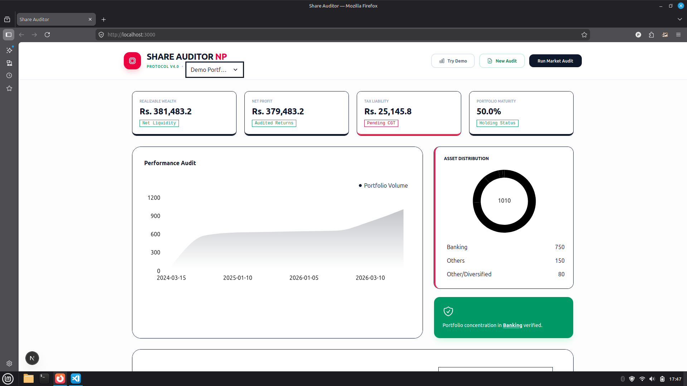

# Share Auditor 🇳🇵

[](https://nextjs.org)
[](https://typescriptlang.org)
[](https://tailwindcss.com)
[](https://tremor.so)
[](LICENSE)
[](https://pnpm.io/)



**Institutional-Grade NEPSE Portfolio Auditor & Risk Engine**

Transform your MeroShare CSV transaction history into actionable insights with live market prices, Nepal CGT tax forecasts, sector exposure analysis, concentration risk alerts, and growth trajectory visualization—all in a modern, responsive dashboard.

> **For Nepalese retail investors** • **Production-Ready** • **Fail-Safe Architecture**  
> **Built with Next.js 16, React 19, and TypeScript 5**

## ✨ Features

### 📊 Market Data Integration
- **Self-Healing Scraper**: Automated market data sync from Sharesansar with Nepse Alpha fallback
- **Real-Time Prices**: Live LTP (Last Traded Price) for all NEPSE scrips
- **Resilient Architecture**: Graceful degradation to mock data if sources fail

### 💰 Financial Calculations
- **Tax Engine**: Accurate CGT calculations (5% long-term, 7.5% short-term)
- **Broker Fees**: Tiered fee structure (0.24-0.36% based on transaction value)
- **Net P&L**: After-tax and after-fee profit/loss calculations
- **Weighted Average Cost**: Proper cost basis for consolidated holdings

### 🎯 Risk Analysis
- **Concentration Risk**: Alerts for portfolios >25% in single scrip
- **Sector Exposure**: Breakdown by sectors (Banking, Hydropower, etc.)
- **Clutter Score**: Identifies dust holdings and low-value positions
- **Diversification Metrics**: Portfolio health indicators

### 📈 Interactive Dashboard
- **Growth Charts**: Area chart showing portfolio value over time
- **Sector Donut**: Visual sector allocation
- **Scrip Bar Chart**: Holdings by value
- **KPI Grid**: Key metrics at a glance
- **Responsive Design**: Works on desktop and mobile

### 🔍 Data Processing
- **CSV Parser**: Handles all MeroShare transaction types (IPO, Bonus, Right, Secondary)
- **Transaction Consolidation**: Merges multiple entries into holdings
- **Data Validation**: Robust error handling and data sanitization

## 🛠️ Tech Stack

```bash
Frontend: Next.js 16 (App Router) | React 19 | TypeScript 5
Styling: Tailwind CSS 4 | Tremor 3 (Charts & Components)
Data: Cheerio 1.0 (Scraping) | PapaParse 5 (CSV) | Dexie 4 (IndexedDB)
Icons: Heroicons | Remix Icons
```

## 🚀 Quick Start

### Prerequisites
- Node.js 20+
- [pnpm](https://pnpm.io/installation) package manager

### Installation

1. **Clone the repository**
   ```bash
   git clone https://github.com/Swastik45/share-auditor.git
   cd share-auditor
   ```

2. **Install dependencies**
   ```bash
   pnpm install
   ```

3. **Start development server**
   ```bash
   pnpm dev
   ```

4. **Open your browser**
   ```
   http://localhost:3000
   ```

### Usage

1. **Upload CSV**: Click "Upload MeroShare CSV" and select your transaction history file
2. **Sync Market Data**: Click "Sync Market Prices" to fetch live prices
3. **View Insights**: Explore the dashboard with charts, metrics, and risk analysis
4. **Export Data**: Download processed portfolio data if needed

## 📡 API Reference

### GET /api/market

Fetches current market prices from NEPSE.

**Response:**
```json
{
  "source": "Sharesansar",
  "data": [
    {
      "symbol": "NABIL",
      "ltp": 1250.50
    }
  ]
}
```

**Fallback Sources:**
- Primary: Sharesansar (sharesansar.com)
- Secondary: Nepse Alpha (nepsealpha.com)
- Tertiary: Mock data (offline mode)

## 🏗️ Project Structure

```
share-auditor/
├── app/
│   ├── api/market/route.ts    # Market data API
│   ├── globals.css            # Global styles
│   ├── layout.tsx             # Root layout
│   └── page.tsx               # Main dashboard
├── lib/
│   ├── calculations.ts        # Tax & P&L logic
│   ├── db.ts                  # Dexie database schema
│   ├── mock.ts                # Sample data
│   ├── parser.ts              # CSV processing
│   ├── sectors.ts             # Sector mappings
│   └── types.ts               # TypeScript types
├── public/
│   └── dashboard.png          # Screenshot
└── package.json               # Dependencies & scripts
```

## 🔧 Development

### Available Scripts

```bash
pnpm dev      # Start development server
pnpm build    # Build for production
pnpm start    # Start production server
pnpm lint     # Run ESLint
```

### Key Libraries

- **@tremor/react**: Modern React components for dashboards
- **cheerio**: jQuery-like API for server-side HTML parsing
- **dexie**: Minimalistic wrapper for IndexedDB
- **papaparse**: Fast and powerful CSV parser
- **@headlessui/react**: Unstyled, accessible UI components

## 🤝 Contributing

Contributions are welcome! Please feel free to submit a Pull Request.

1. Fork the repository
2. Create your feature branch (`git checkout -b feature/amazing-feature`)
3. Commit your changes (`git commit -m 'Add some amazing feature'`)
4. Push to the branch (`git push origin feature/amazing-feature`)
5. Open a Pull Request

## 📄 License

This project is licensed under the MIT License - see the [LICENSE](LICENSE) file for details.

## 🙏 Acknowledgments

- Built for the Nepalese investment community
- Inspired by the need for better portfolio analysis tools
- Special thanks to the open-source community

---

**Made with ❤️ by [Swastik Paudel](https://github.com/Swastik45)**
```

**Production Build:**
```bash
pnpm build
pnpm start
```


**Key Modules:**
- `lib/calculations.ts`: Tax logic, aggregations.
- `app/api/market/route.ts`: Dynamic LTP extraction.
- `lib/types.ts`: Full type safety.


## 🔬 Self-Healing Pipeline

1. **Primary:** Parse Sharesansar HTML headers dynamically (`thead th` → LTP/Symbol indices).
2. **Fallback:** `nepse-data-api.herokuapp.com` (4s timeout).
3. **Safe-Mode:** Hardcoded LTPs for weekends/outages.
4. **Circuit Breaker:** Auto-retry + console audit logs.

## 🧪 Local Development

```bash
# Lint & Type Check
pnpm lint

# Add CSV sample to public/
# Test scraper: curl http://localhost:3000/api/market
```

**Env Vars:** None (stateless).

## 🚀 Roadmap

- [ ] PDF Export (audited reports)
- [ ] Real-time alerts (concentration thresholds)
- [ ] WalletConnect NEPSE API integration
- [ ] Mobile PWA
- [ ] VSCode Extension (CSV preview)

## 🤝 Contributing

1. Fork → Branch (`feat/xyz`)
2. `pnpm install && pnpm dev`
3. PR to `main` with tests.

Issues? [Open one](https://github.com/Swastik45/share-auditor/issues/new).

## 📄 License

MIT © [Swastik Paudel](https://github.com/Swastik45)  
**Pokhara, Nepal 🇳🇵** • **April 2026**

